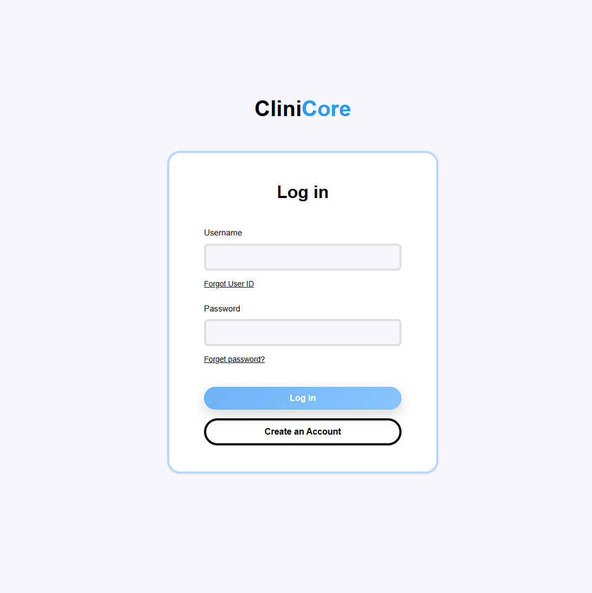
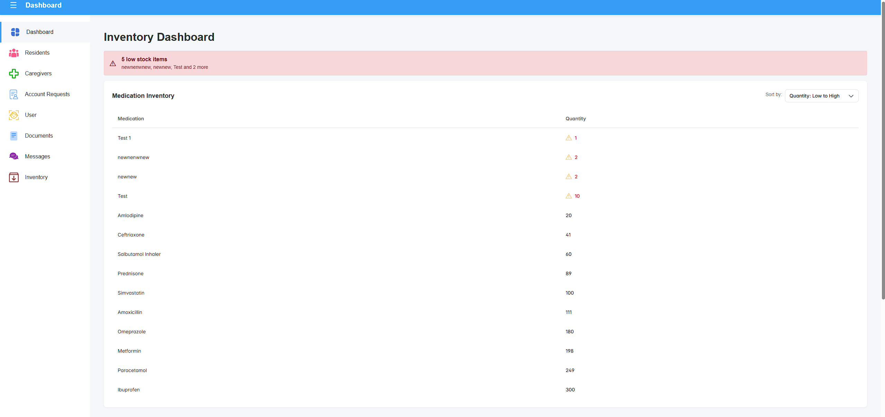
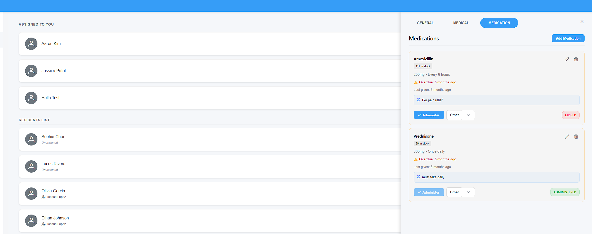
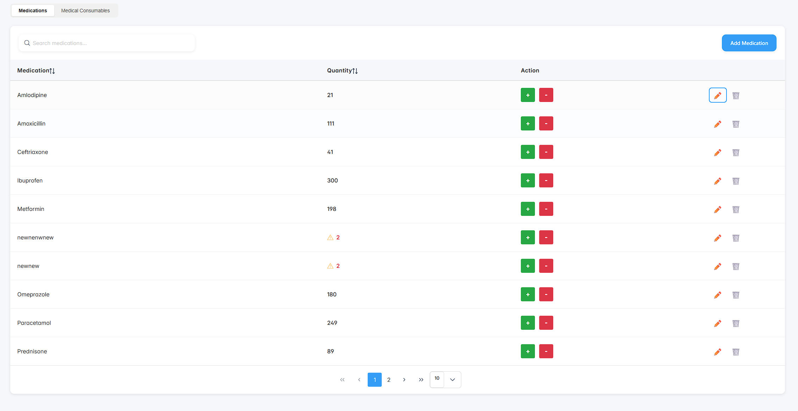
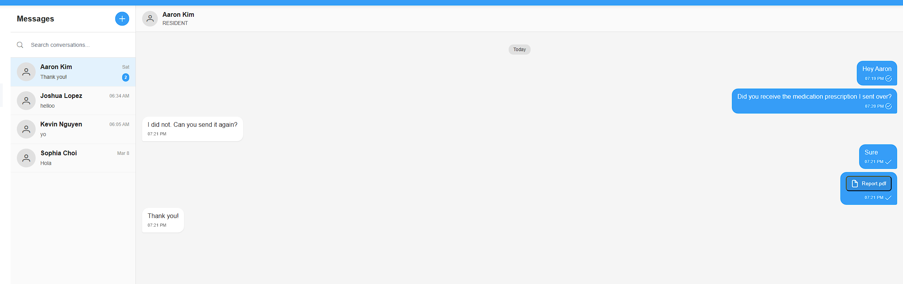

[](https://maven.apache.org/)
[](https://nodejs.org/en)
[](https://openjdk.org/)
[](https://spring.io/projects/spring-boot)
[](https://spring.io/projects/spring-security)
[](https://www.mysql.com/)
[](https://hibernate.org/)
[](https://jwt.io/)
[](https://react.dev/)
[](https://reactrouter.com/)
[](https://vite.dev/)
[](https://primereact.org/)


# CliniCore


CliniCore is a custom-built Electronic Health Record (EHR) web application developed by **Lattice Labs**, a team of undergraduate Computer Science students at California State University, Sacramento. The application was created to replace an outdated EHR system used by a local medical care facility, providing staff with a modern, intuitive, and secure platform tailored specifically to the client's workflows and business needs.

---

## Table of Contents

- [What the Application Does](#what-the-application-does)
- [Why It Was Created](#why-it-was-created)
- [Features](#features)
- [Screenshots](#screenshots)
- [Installation & Setup](#installation--setup)
- [Testing](#testing)
- [Team Members](#team-members)

---

## What the Application Does

CliniCore gives administrators, caregivers, and residents a role-based portal for managing the day-to-day operations of a residential care facility. Admins and caregivers can manage resident health records, track medication schedules, monitor supply inventory, and communicate with staff and family members — all from a single secure platform. Residents have read-only access to their own health information, medication schedules, and messages. Every action is protected by JWT-based authentication and AES-256 encrypted messaging to ensure patient data remains confidential.

## Why It Was Created

The client's previous EHR system was rigid, difficult to navigate, and lacked the specific features their care team relied on daily. CliniCore was built from the ground up to match the exact specifications of their practice — from the structure of resident medical profiles to how medication intake is tracked and reported. The goal was to deliver a production-ready replacement that the care team could adopt without retraining, while meeting modern security and compliance standards for handling sensitive health data.

## Features

- [x] Allows easy management of medical supplies and medication stock levels
- [x] Provides caregivers with a dashboard to track daily tasks and patient information
- [x] Streamlines communication between staff members, family members, and residents through an internal messaging system
- [x] Fast and secure logins for both patients and staff to access and store confidential medical information
- [x] Tailor made for the client's specifications and business needs
- [x] Role-based access control for Admin, Caregiver, and Resident accounts
- [x] Resident health records with General, Medical, and Medications tabs
- [x] Encrypted internal messaging (AES-256)

---

## Screenshots

<table>
  <tr>
    <td align="center" width="50%">
      <strong>Login Page</strong><br/>
      <sub>Secure login screen where staff and residents authenticate with their credentials.</sub><br/><br/>
      
    </td>
    <td align="center" width="50%">
      <strong>Admin Dashboard</strong><br/>
      <sub>Full overview of residents, active tasks, and quick navigation to all management areas.</sub><br/><br/>
      
    </td>
  </tr>
  <tr>
    <td align="center" width="50%">
      <strong>Resident Portal — Medications Tab</strong><br/>
      <sub>Medication list with intake status badges, dosage, and schedule. Admins and caregivers can add, edit, update status, and remove medications.</sub><br/><br/>
      
    </td>
    <td align="center" width="50%">
      <strong>Inventory Management</strong><br/>
      <sub>Track medication stock levels, view quantities, and identify low-stock items.</sub><br/><br/>
      
    </td>
  </tr>
  <tr>
    <td align="center" colspan="2">
      <strong>Internal Messaging</strong><br/>
      <sub>Encrypted messaging interface for secure communication between staff members.</sub><br/><br/>
      
    </td>
  </tr>
</table>

---

## Installation & Setup

### Prerequisites

- Java 21+
- Apache Maven 3.8+
- Node.js 18+ and npm
- MySQL 8+

### 1. Clone the Repository

```sh
git clone https://github.com/your-org/clinicore.git
cd clinicore
```


### 4. Start the Backend

```sh
cd Backend
mvn spring-boot:run
```

The backend starts on `http://localhost:8080` by default.

### 5. Start the Frontend

```sh
cd Frontend
npm install
npm run dev
```

The frontend starts on `http://localhost:5173` by default.

---

## Testing

The backend includes a full suite of integration and unit tests built with **JUnit 5**, **Spring Boot Test**, and **Mockito**. Tests run against a real MySQL database using the credentials in `Backend/src/test/resources/application.properties`.

### Run All Tests

```sh
cd Backend
mvn test
```

### Run a Specific Test Class

```sh
mvn test -Dtest=ResidentMedicationManagementIntegrationTest
```

### Test Coverage

<details>
<summary>View full test coverage table</summary>

| Test File | What It Covers |
|---|---|
| `ResidentMedicationManagementIntegrationTest` | Add, edit, update status, and delete medications via Admin and Caregiver roles; invalid inputs (missing resident, bad medication ID, invalid status value) |
| `ResidentMedicationInformationControllerIntegrationTest` | Role-based read access to medication fields by Resident, Caregiver, and Admin |
| `ResidentMedicalInformationControllerIntegrationTest` | Role-based read access to medical profile, capabilities, and services |
| `ResidentControllerIntegrationTest` | Resident CRUD, medical profile updates, resident info updates |
| `CaregiverControllerIntegrationTest` | Caregiver list and assignment endpoints |
| `InventoryControllerIntegrationTest` | Inventory management and low-stock queries |
| `MessagesControllerIntegrationTest` | Encrypted messaging between users |
| `AccountCredentialControllerIntegrationTest` | Login, account creation, credential management |
| `AccountRecoveryIntegrationTest` | Password reset and account recovery flows |
| `JwtServiceTest` | JWT token generation, validation, tamper detection |
| `EncryptionServiceTest` | AES-256 GCM encryption/decryption round-trips |
| `PasswordServiceTest` | Argon2 password hashing and verification |

</details>

---

## Team Members

**Lattice Labs** — California State University, Sacramento


<table>
  <tr>
    <td align="center">
      <a href="https://github.com/aimsngn">
        <br/>
        <sub><b>Olei Amelie Mae Ngan</b></sub>
      </a><br/>
      <sub>Developer</sub>
    </td>
    <td align="center">
      <a href="https://github.com/OniiSean">
        <br/>
        <sub><b>Sean Bombay</b></sub>
      </a><br/>
      <sub>Developer</sub>
    </td>
    <td align="center">
      <a href="https://github.com/anhminh34">
        <br/>
        <sub><b>Minh Nguyen</b></sub>
      </a><br/>
      <sub>Developer</sub>
    </td>
    <td align="center">
      <a href="https://github.com/mileslle">
        <br/>
        <sub><b>Miles Le</b></sub>
      </a><br/>
      <sub>Developer</sub>
    </td>
  </tr>
  <tr>
    <td align="center">
      <a href="https://github.com/rushabhpatell">
        <br/>
        <sub><b>Rushabh Patel</b></sub>
      </a><br/>
      <sub>Developer · rushabhpatel109@gmail.com</sub>
    </td>
    <td align="center">
      <a href="https://github.com/adrianpxrez">
        <br/>
        <sub><b>Adrian Perez</b></sub>
      </a><br/>
      <sub>Developer</sub>
    </td>
    <td align="center">
      <a href="https://github.com/winniwu07">
        <br/>
        <sub><b>Winni Wu</b></sub>
      </a><br/>
      <sub>Developer</sub>
    </td>
    <td align="center">
      <a href="https://github.com/hyemdanu">
        <br/>
        <sub><b>Edison Ho</b></sub>
      </a><br/>
      <sub>Developer</sub>
    </td>
  </tr>
</table>
